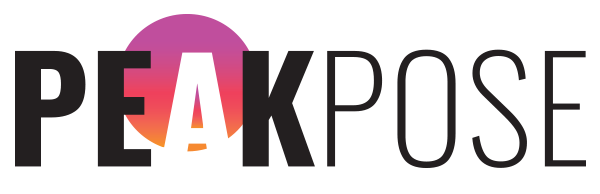

# Peak Pose

Peak Pose is a web application that gives yogis a platform to perfect their alignment.

Using their webcam, the user has the ability to select various yoga poses and compare their stance.

### Getting Started:

Clone the repo:

`git clone https://github.com/nomats/asanaApp.git`

Install Dependencies:

`yarn install`

### Usage:

To start the application:

`yarn start`

Runs the app in the development mode.<br>
Navigate to [http://localhost:3000](http://localhost:3000) to view in the browser.


To test the application:

`yarn test`

Launches the test runner in watch mode. Select `a` to run all tests.


### User Stories
```
As a Yogi
So I can check my accuracy,
I want confirmation my neutral pose is correct
```

```
As a Yogi
So I can check my accuracy,
I want to test myself against multiple poses
```

```
As a Yogi
So I can check my accuracy,
I want to know which parts of my body are out of line
```


### Schedule

| #   | Sprint                                  | Deadline   |
| :-- | :-------------------------------------- | :--------- |
| 1   | MVP ([Mockup](./public/mockUp-MVP.png)) | 20/03/2019 |
| 2   | AsanaWrap / React Front-end             | 22/03/2019 |
| 3   | Individual Poses (Weekend)              | 24/03/2019 |
| 4   | Integration Model / View                | 26/03/2019 |
| 5   | Integration ctd. + Styling              | 28/03/2019 |
